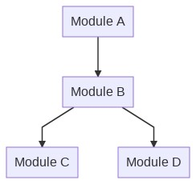

Integration Testing
===================

It is a step in the testing process that lies among unit tests and system tests. All the modules of the system, that ideally were tested in unit tests, are combined  to guarantee that they work together properly. We can consider that it works as a preparation for System tests. Data is transferred between the modules and is tested thoroughly.

Let's consider a scenario where an application is developed, and its modules are assigned to different developers. Using the image below as an example, each module could be due to a different programer to develop in order to increase velocity. 

How the development of integration tests for this system could have be done?

## Big Bang
This approach would wait every module to be fully coded in order to write tests. It doesn't sound as a good idea, as the time of development would increase. Also, testing all of them at once makes harder to trace errors.  

## Incremental Approach
The Incremental Approach keeps on testing every module as long as they are available for testing. Here, we face a challenge: Imagine that `Module B` in our example above is the first to be ready. How do we test if it works together with other modules as they are not ready? We can use `Drivers` or `Stubs` depending on what approach we choose. 

### Top Down 
To test if it works well with the modules beneath it, we can make the use of `Stubs` to simulate the behavior of the missing modules. 

#### Stubs
A `stub` is a simpler object that have pre-determined answers for calls made during the test execution. Usually, it doesn't do anything extra about what was specifically coded for the test itself. 

In our case, to test the integration between `Module B` and `Module D`, for example, we could make a `stub` of the `Module D` in order to mock its behavior and test if `Module B` is working properly with it. 

### Bottom Up
Similarly to the situation we face with the lack of `Module D`, `Module A` could not be ready for integration. So we also have to simulate the behavior of `Module A`, to test the integration with `Module B`. That's when `Drivers` come to action. 

#### Driver
Drivers are designed to simulate the behavior of modules placed in a upper level. They work as a provisional module to provide the same effect that would be achieved by calling the actual module.

### Other ways of simulating objects in testing 

#### Mocks 
Mocking is a technique that aims to create simulated version of services or objects related to your program, not mattering wether internal or external, that can effectively replace its real versions in order to make the test faster and more reliable. When the code interacts with an object, with its functions or attributes, a mock can be used instead.

#### Dummy
Dummy objects are those with no functionality, but its purpose in testing is basically fill in parameters, for example. 
