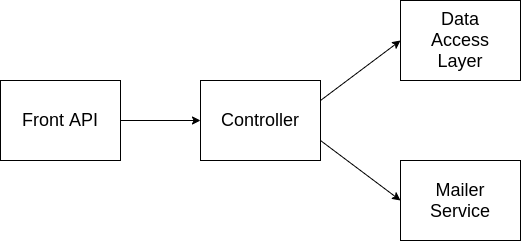

Integration Testing
===================

It is a step in the testing process that lies among unit tests and system tests. All the modules of the system, that ideally were tested in unit tests, are combined  to guarantee that they work together properly. We can consider that it works as a preparation for System tests. Data is transferred between the modules and is tested thoroughly.

Let's consider a scenario where a mailing system that records all emails sent is developed, and its modules are assigned to different developers. Using the image below as an example, each module could be due to a different programer to develop in order to increase velocity. The front API can be any kind of interface for the client to invoke like a website or a rest API, the controller is responsible for invoking the mailer service and recording the history using the Data Access Layer which is a layer for accessing some kind of storage which will be able to save the emails history in a structure somehow.

## Integration Strategies

There are some methods to tackle the issue of testing this whole flow regarding the development of tests, one of them is the *Big Bang* [1] method which we code everything and then code the tests but this is usually a bad idea since it would cost more in time and it would be harder to trace errors since it is hard to isolate bugs, but it is also possible to test using an *Incremental Approach* [2] by developing the integration tests while working on the module, but to do so it is needed to input something similar to the output of the original module and the modules must agree beforehand their expected outputs and inputs, eg.: It is possible to test the Front API by faking the controller response and passing it as an input for the Front API.

## Situational Examples

Let's say that we are developing the controller but the Data Access Layer (DAL) and the Mailer Service are still under development, but we still need to test the controller somehow and to do so it is possible to use stubs to replace the DAL and the Mailer Service. Stubs are simple objects with pre-determined answers for certain executions durint the tests.

Now we can assume that the Mailer Service and the DAL are under development but the controller is not ready yet, but we need to test the controller behavior on dealing with both modules. Using a Driver in this scenario may be the best option since the Driver is a provisional module that emulates the behavior of a module in a upper level and in this case it would emulate the Controller.

## Techniques

Depending on the language used on the project it is possible to have more or less flexibility on testing, for example, in Python there isn't a hard limitation for accessing private fields, so it is easy to access such fields and the language provides native support to do so, but on the other hand, JVM based languages such as Java, locks any kind of access to private fields during tests, but there are some frameworks that are able to tweak the generated bytecode during the compile in order to expose those fields only for testing. But in most languages it is possible to use some of the techniques detailed bellow.

- Dummy objects with no funcionality that just needs to fill some space like filling parameters. In our sample mailer this could be done by implement a fake mailer service with the same interface as the original service but with no function and pre configured results.
- *Mocking* [3] is a technique that aims to create simulated version of objects related to your application in order to assert that the functions were called correctly or to simulate only certain functions of an implemented object. This could be used to mock the DAL access to a real database and return fake results only for testing purposes.

## Hands On

- Mocking with Python

- A Driver example with Python

## References

1. Software Testing Dictionary. [Blog] Available at: <https://www.tutorialspoint.com/software_testing_dictionary/> [Accessed 10 August 2020].
2. What Is Incremental Testing: Detailed Explanation With Examples. [Blog] Available at: <https://www.softwaretestinghelp.com/incremental-testing/> [Accessed 10 August 2020].
3. Osherove, Roy (2009). "Interaction testing with mock objects et seq". The art of unit testing. Manning. ISBN 978-1-933988-27-6.
