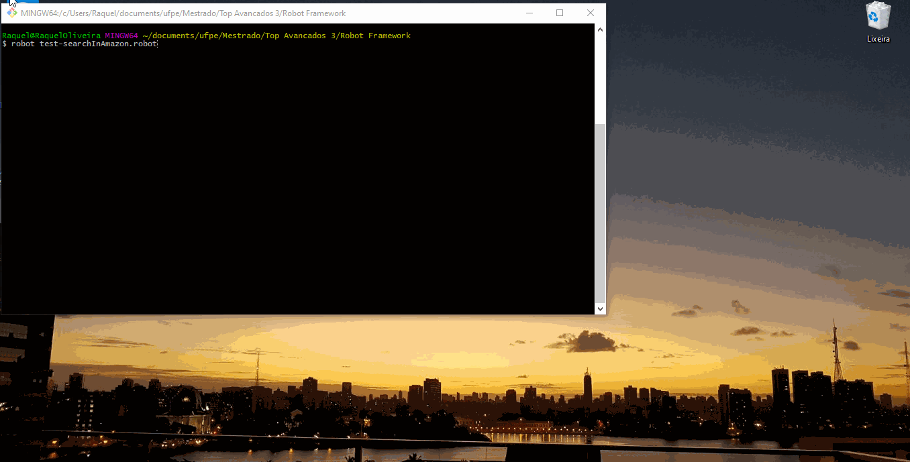

System Testing
==============

## Introduction

Traditionally, system testing is done when the software is working as a whole. An iterative life cycle allows system testing to take place much earlier, once well-formed subsets of use-case behavior are implemented.

The system test can be considered the "third phase" of the tests, being the first unit or unit test, which tests the smallest units in the system, looking for logic and implementation errors in each module, separately. The second would be the integration test, which aims to detect flaws in the interaction between the units, generally the types of flaws found are sending and receiving data. Remembering that integration with other systems is not part of this phase.
In practice they are executed under conditions similar to those that the user will use.

For this, one of the ways used to simulate the user environment in a quick and practical way, is the automated interface tests.

## Framework

### ROBOT

Robot is considered a framework and not just a test automation tool because it was built to provide all the necessary structure to meet an entire acceptance test automation architecture {cite}`robotdocumentation`. It allows to use keyword-driven, data-driven and / or behavior-driven (BDD) approaches. It has an easy-to-use tabular data syntax and allows users to use and create libraries in Python or Java. Has easy syntax, using human-readable keywords. The framework has a rich ecosystem around it, consisting of libraries and tools that are developed as separate projects.

#### Main advantages

Having comprehensive documentation makes it easier to work with any tool. The Robot Framework is no exception, and has great documentation on their website.

Also, after each test run, the Robot Framework provides a clear, concise, and human-readable HTML-test report. These reports are based on XML outputs from the tests. As an all-in-one reporting, it also helps when presenting to other stakeholders within an organization.

The example below shows a test that aims to open a web page using the firefox browser: the first version is written using Python and Selenium webdriver, the second using the Robot framework.

 * Python with Selenium WebDriver:
```python
def setUp(self):
self.driver = webdriver.Firefox() 
self.driver.implicitly_wait(20)
self.base_url = "https://www.facebook.com/" self.verificationErrors = [] self.accept_next_alert = True Keyword
```
 
 * Selenium Webdriver and Robot Framework:
 
    Open Browser https://www.facebook.com/         firefox


## CODE STRUCTURE

The structure of the script is simple and can be divided into four sections:

### Documentation
This keyword precedes the description of the functionality or test scenario. Be aware, because if the documentation is made in the section **Settings**, it should not be enclosed in square brackets. They are only used within **Test Cases**

`This test open the webpage “https://www.amazon.in”
Search for “unit test book” and then verify if the results match.`

### Settings
This is where you configure the libraries to be used, paths to auxiliary files (page objects, for example), contexts and hooks.

`Library           Selenium2Library
Suite Setup  Go to homepage
Suite Teardown  Close All Browsers`

### Variables
List of variables to be used (preferably with description) and definition of the values of some of these variables.

`${HOMEPAGE}      https://www.amazon.in
${BROWSER}        chrome`

### Test Cases
This is the most important section, because without it your test will not run. This is where the test cases / scenarios are, with or without implementation.

`Amazon page and find books
    Amazon and check results   unit test book   results for "unit test book"`

### Keywords

Here you can define keywords or implement the test scenarios described above. All of the above sections are optional, depending on how your code was written, except for **Test Cases**. I advise you to always use them for a better organization of the code. 
The labels below are not mandatory, but they also help with the organization.

`Amazon and check results`

`    [Arguments]     ${searchkey}     ${result}`

`    Input Text      id=twotabsearchtextbox     ${searchkey}`

`    Click Element    xpath=//div[@class='nav-search-submit nav-sprite']/input[@class='nav-input' and 1]`

`    Wait Until Page Contains    ${result}`
 
`Go to homepage
    Open Browser    ${HOMEPAGE}     ${BROWSER}`
    
### Spaces and Variables
The variables in the Robot are represented by `${variable}`. The Robot has the peculiarity of ignoring a space between words. 
`${variable_name}` is equal to `${variable name}`. They are also case insensitive. The arguments are divided into at least two spaces. For example:

* command (two spaces) argument1 (two spaces) argument 2.

Note that the space in “argument 2” is ignored. The assignment sign (=) is also optional. Values can be assigned, either:
* `$ {value} value`
* `$ {value} = value`

An important observation to be made is that, being the Robot Framework based on Python, it is worth mentioning that this is an indented language, that is, command blocks are separated by spaces or tabs, forming a mandatory visual indentation. There are no *“open”* and *“close”* symbols, Robot inherits this formatting.


## Hands On: Robot with Selenium2Library
 
> [Selenium2Library](https://robotframework.org/Selenium2Library/Selenium2Library.html) is a web testing library for Robot Framework.

To execute a robot program, some requirements are necessary. Let's go to the codelab to see how it work!

<a 
href="https://colab.research.google.com/github/damorimRG/practical_testing_book/blob/master/testgranularity/robot.ipynb" target="_blank"> 
    </a>
    
## Execution  

Now that you know the structure of a robot program, the complete code is showed below and will do the following steps:
1. open the google chrome browser
2. open the website https://www.amazon.in 
3. in the search bar it will type "unit test book"
4. check if the results returned in the search correspond to test books of unity

To identify the search bar and button, their respective html identifiers are used in the javascript code of the page.

**Tip**: just open the page, and with the right button choose *inspect*.

` *** Settings *** `

`Library           Selenium2Library`

`Suite Setup  Go to homepage`

`Suite Teardown  Close All Browsers`


`*** Variables ***`

`${HOMEPAGE}      https://www.amazon.in`

`${BROWSER}        chrome`

 
`*** Test Cases ***`

`Amazon page and find books`

`Amazon and check results   unit test book   results for "unit test book"`

 
`*** Keywords ***`

`Amazon and check results`

`    [Arguments]     ${searchkey}     ${result}`

`    Input Text      id=twotabsearchtextbox     ${searchkey}`

`    Click Element    xpath=//div[@class='nav-search-submit nav-sprite']/input[@class='nav-input' and 1]`

`    Wait Until Page Contains    ${result}`
 
`Go to homepage`

`    Open Browser    ${HOMEPAGE}     ${BROWSER}`

To start running the Robot Framework we will use the robot that runs the test scripts and the rebot for the processed results.

You must create a file and save it as a .robot to place all your test cases. Then run:

*robot namefile.robot*



This command will run the test suite and generate screenshots and files with all test reports.

---
**Challenge. Let's Test!**
> On this {cite}`robotlibrary` [*link*](http://robotframework.org/SeleniumLibrary/SeleniumLibrary.html#Click%20Link) site you will find all the keywords that can be used to create web interface tests using this same configuration.
> Use and abuse your creativity to create more tests.
>
>To encourage you, I challenge you to create a test that opens firefox browser, go to {cite}`robotorg` robotframework.org and capture a screenshot of the home screen.
---

## References

```{bibliography} ../zreferences.bib 
    :style: plain 
    :filter: docname in docnames
```