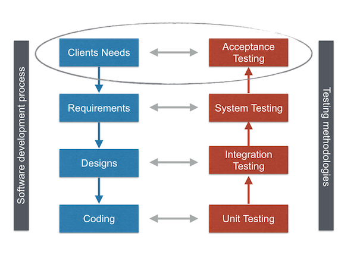
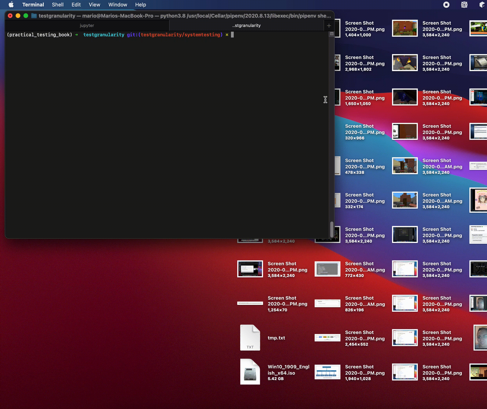

# System Testing

The second-last level of tests' granularity is System Testing. System Testing has the purpose of evaluating the end-to-end system specifications. Meaning it validates the complete and fully integrated software product.

Usually it involves testing the fully integrated applications including external peripherals in order to check how components interact with one another and with the system as a whole. Besides that, it also looks out for applications inputs and outputs and evaluating User's experience.

## Hands On: Robot with Selenium2Library

To show an example we are going to simulate the user environment in a quick and practical way using automated interface tests.

We are going to use: [Robot framework](https://robotframework.org), a generic open source automation framework that can be used for test automation; and [Selenium2library](https://robotframework.org/Selenium2Library/Selenium2Library.html), a web testing library for Robot Framework to start a _headless_ Google Chrome browser and automatically execute system tests. We are going to end up with something like the Gif below.

Click in the link to open the example on Google Colab!

  

## Is System Testing equivalent to functional testing?

No. The difference between System Testing and Functional Testing is that System Testing tests the entire product or section of a product while Functional Testing only tests a single feature within a section of a product. In theory if you have tested all of the features of your product using Functional Testing and then at the end of development before you ship you perform a System Test on your entire product you should have a pretty easy time with your System Test because it has been incrementally tested using Functional Tests along the way.

## Final Considerations

System Testing can cover a complete end to end applications while testing both Business requirements and System Software Arquitecture. It can help finding issues and bugs on the application before it goes into production. However, testing with frameworks requires a long time and can increase costs if relies on business necessities and application arquitecture.

In a nutshell, System Testing can improve software quality and prevent some issues and bugs to ever affect the end users. Nevertheless, they must be used with caution since they can slow down the testing process increasing production costs and time.

## References

- [Robot framework](https://robotframework.org)
- [Selenium2library](https://robotframework.org/Selenium2Library/Selenium2Library.html)
- [Wikipedia System Testing](https://en.wikipedia.org/wiki/System_testing#cite_ref-1)
- [System Testing And Functional Testing](https://www.agnosticdev.com/blog-entry/testing/system-testing-and-functional-testing#:~:text=So%20the%20difference%20between%20System,a%20section%20of%20a%20product.)
- [Pros & Cons with Working Process of System Testing](https://www.testorigen.com/pros-cons-with-working-process-of-system-testing/)
- [What is System Testing? Types & Definition with Example](https://www.guru99.com/system-testing.html)
