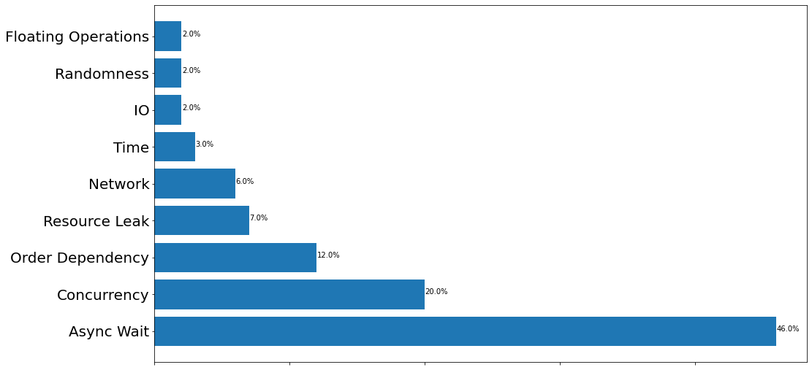
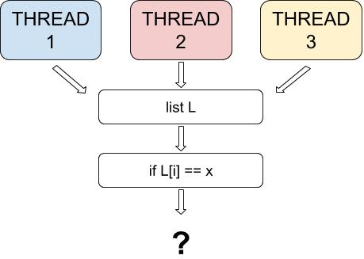

Flaky test
================


Unit tests should always have the same results: it will fail or it will pass. In other words, the result should be deterministic. But, sometimes, the same test shows both behaviors, even if there was no change in that unit{cite}`deflaker`. These non-deterministic tests are known as Flaky Tests and they are more common than you might think, a Google Engineer{cite}`googleflakytest` says that 16% of their tests have some flakiness.
When the code is passing in the Continuous Integration (CI) system, and a failure occurs, it ends up slowing down or preventing the evolution of the entire pipeline until the fault is found and resolved causing an increase in cost. The problem is that it is difficult to know when a test really failed or when it is Flaky{cite}`googleflakytest`.

## Example of a flaky test

Let's see a practical example of flaky test. Below we have a test with an Async Wait flakiness. It generates a randon number between 1 and 10 and passes this value as a paramater to a sleep function. 

~~~
import random
import time
from threading import Thread

class app(Thread):
  def __init__ (self):
    Thread.__init__(self)
    self.res = 0

  def setResult(self, result):
    self.res = result

  def getResult(self):
    return self.res

  def run(self):
    sleep_length = random.random() * 10
    time.sleep(sleep_length)
    self.setResult(100)
~~~

To test the code, we're going to use unittest, a python unit testing framework. In our test we start a thread as defined above and wait 7 seconds to get the result from that thread. If the random sleep time from the thread is higher than 7 seconds, the value of 'result' won't have been set to 100 when the assertEqual function runs and the test will fail, if it's lower, the test will pass.
~~~
import unittest
import time

class AppTestCase(unittest.TestCase):
    def test_app_function(self):
      app_test = app()
      app_test.start()
      time.sleep(7)
      self.assertEqual(100, app_test.getResult())
~~~

Now let's run the test and see what output it gives:

~~~
suite = unittest.TestLoader().loadTestsFromTestCase(AppTestCase)
unittest.TextTestRunner().run(suite)
~~~
~~~
F
======================================================================
FAIL: test_app_function (__main__.AppTestCase)
----------------------------------------------------------------------
Traceback (most recent call last):
  File "<ipython-input-51-25320b01c54c>", line 9, in test_app_function
    self.assertEqual(100, app_test.getResult())
AssertionError: 100 != 0

----------------------------------------------------------------------
Ran 1 test in 7.006s

FAILED (failures=1)
<unittest.runner.TextTestResult run=1 errors=0 failures=1>
~~~

The test fails. The sleep time of the thread is higher than the sleep time of the test. Let's try it again:

~~~
suite = unittest.TestLoader().loadTestsFromTestCase(AppTestCase)
unittest.TextTestRunner().run(suite)
~~~
~~~
.
----------------------------------------------------------------------
Ran 1 test in 7.009s

OK
<unittest.runner.TextTestResult run=1 errors=0 failures=0>
~~~

Now the test passes. The random behavior exhibited by this test is an example of flakiness caused by Async Wait, as we'll explain next.


## Top causes for flaky tests

According to Luo and colleagues{cite}`10.1145/2635868.2635920` a test can be flaky for several reasons as shown in the graphic bellow:



 Async wait, concurrency, test order dependency are the most common types so let's explain more about them.


*   **Async wait**: In an asynchronous wait, sometimes the developer uses a **sleep** function to wait for the end of the execution. If the function finishes before this time, the test passes, if it takes more time, it fails. Many flaky tests caused by the async wait can be fixed using **waitFor**{cite}`10.1145/2635868.2635920`. This function, instead of presetting a specific amout of time to wait, bounds to the ocurrence of an action, meaning it waits until a certain action takes place. 

*   **Concurrency**: Just like the async wait problem, other issues related to concurrency also have great impact in causing tests to be flaky. These generally derive from the developer not being mindful of the order in which the operations are being executed by the different threads. This can be settled by adding a synchronization block or making sure the correct execution order of  threads is being obeyed{cite}`10.1145/2635868.2635920`.



In the case presented in this figure, the threads are modifying a shared list. When we try to check if an element of the list is equal to a certain value “x”, depending on which thread modified it last the outcome can be different, causing this code to behave non-deterministically.  

*   **Test Order Dependency**: Sometimes, a test assumes implicit requirements that can't be complied due to some modification made during the execution of a previous test. In this case, the order in which a set of tests is executed plays a role in influencing the occurrence of a certain output{cite}`ifixflakies`. For that reason tests should be independent from each other.


As shown in the figure above, when Test 1 for the function isEmpty() is isolated it passes. But when we run Test 2 for insert() before Test 1, Test 1 fails. We added a new value into the list, so it isn’t empty as expected. However, when we run Test 3 for the function remove() after Test 2 and before Test 1, Test 1 passes again. This time, despite having added a new value into the list, we removed it right after, so when Test 1 runs the list is empty again.

## Identifying flaky tests

One way to identify these tests is to re-run the tests several times and mark the tests that show contradictory behaviors as “flaky”. But, it's hard to determine how many times you need to re-run a test until it proves to be flaky{cite}`deflaker`. It could still happen that your test exhibited a consistent behavior of failure but it was flaky. What some developers do is to set a threshold for the number of executions after which if the test continuosly gives a failure, they would consider to truly exist a bug in the code{cite}`googleflakytest`. 

There are also tools, like [SCOPE](https://scope.dev/){cite}`scope`, that help to identify these tests in a single run.  

The important thing is to identify the flakiness as soon as possible. Establishing a routine where the system is tested several times helps to identify a flaky earlier, reducing the impact on the development of the project.

## Dealing with flaky tests

Now that we know what a flaky test is and what could cause them, we need to learn how to deal with this type of test.

The approach some teams have to deal with flaky tests is to reject the test that exhibited this behavior, as examining if the issue is with the test or with the code takes time and delays development{cite}`googleflakytest`. Hence the easiest and most straightforward approach is to assume that the test is incorrect and not the code. However, this can’t be the best alternative, because if there is in fact a bug in the code it can escalate to bigger problems by pushing a broken code ahead.

A safe initial approach is to start tagging tests that are flaky. Beyond that, you'll need to investigate the reason why a test showed such behavior and to further analyze the impact caused by this issue. In this case, it's extremely important to collect as much information as possible during the execution of each test: logs, specificities from the environment and memory data from the moment the test was executed, etc{cite}`scope`. This way it’s easier to reproduce the test that failed and to compare what’s different from the test that passed. As mentioned before, some teams reproduce a failed test countless times, which also helps to evaluate how flaky a test is. Another important piece of information to be considered is when this test started to flake, since it's usually more complex to find the root problem in tests with older failures.

Once a test is tagged as flaky and data about its execution is collected, you can put this test into quarantine. Its output is disregarded and it shouldn’t be executed in the master pipeline until the issue with it is fixed{cite}`scope`. Then the assigned developer will start debugging the test, equipped with all the information about in which context this specific test failed and in which it passed. Because most teams set dealing with flaky tests as a high priority, these tests are generally fixed quickly{cite}`scope`.

## Hands On

You can execute the example we showed earlier in the following notebook. Run the test several times and analyze the different outputs.

<a 
href="https://colab.research.google.com/github/damorimRG/practical_testing_book/blob/master/testregression/Flaky_Tests_Hands_On.ipynb" target="_blank"> 
</a>
      
## Quiz

If you want to test the concepts shown here, try this [quiz](https://docs.google.com/forms/d/1mc1ZDXUFzViTQepWg0VxDJfwT_S09ITPSC8o97D2a2k/viewform?edit_requested=true).

## References

```{bibliography} ../zreferences.bib
    :style: plain 
    :filter: docname in docnames
```